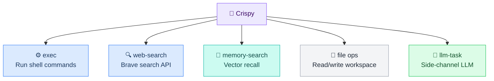
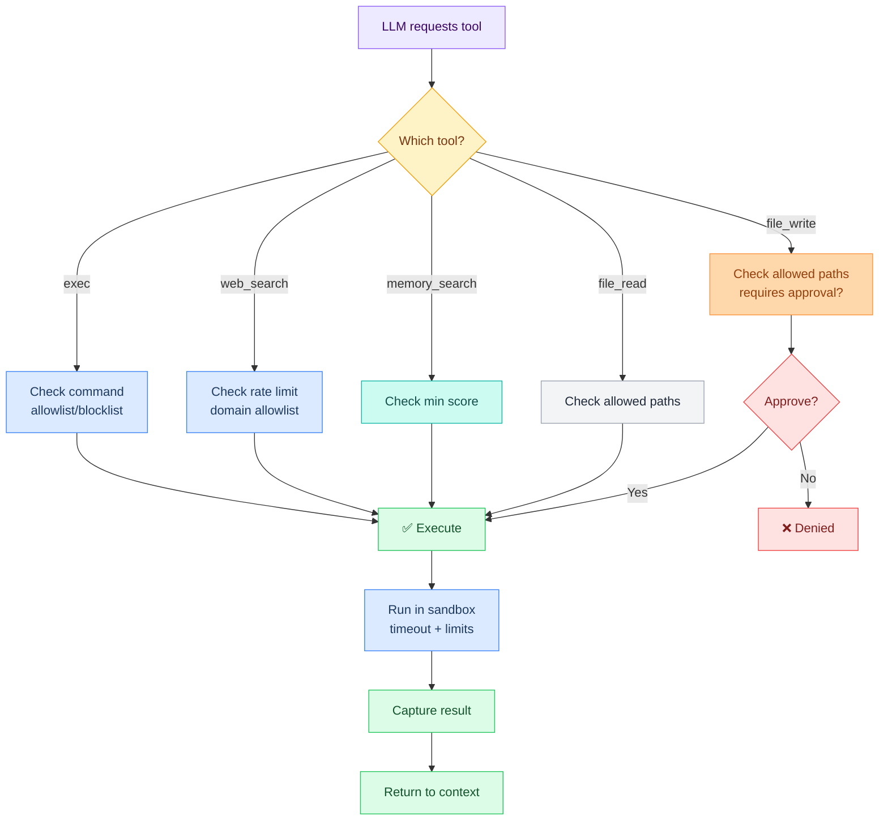
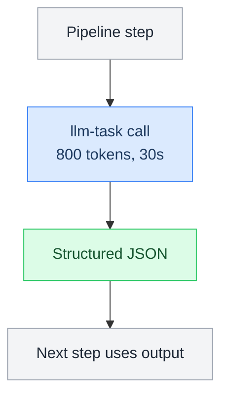
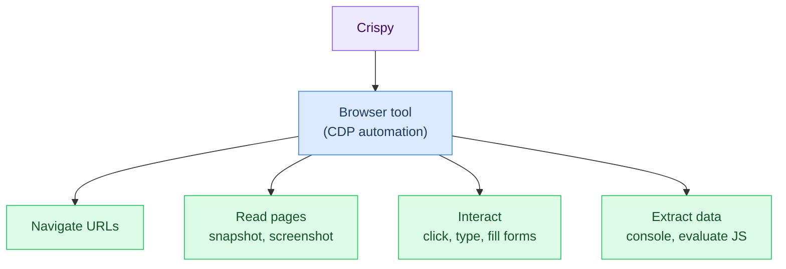

# L6 — Tools

> All available tools Crispy can invoke: built-in exec, web search, memory access, file ops, and plugins.

---

## Built-In Tools

Crispy has access to these core tools:



---

## 1. exec — Sandboxed Shell Commands

Run arbitrary shell commands in a controlled sandbox.

```json5
{
  "toolName": "exec",
  "args": {
    "command": "git status --porcelain",
    "workingDir": "/home/user/.openclaw/workspace",
    "shell": true,
    "timeout": 30000
  },
  "sandbox": {
    "profile": "sandboxed",
    "workspaceAccess": "rw",
    "networkAccess": false,
    "fsAllowlist": ["/home/user/.openclaw/workspace"],
    "timeoutMs": 30000
  },
  "result": {
    "stdout": "M README.md\n?? new-file.txt",
    "stderr": "",
    "exitCode": 0
  }
}
```

**When to use:**
- Git operations (status, log, branch)
- File operations (ls, find, grep)
- System info (df, uname, which)
- Running Python/Node scripts

**Restrictions:**
- No `sudo`, no network access by default
- Workspace read/write only (no system files)
- 30-second timeout
- No privilege escalation

**Approval:** Not required (sandboxed)

---

## 2. web-search — Brave Search API

Search the web for information.

```json5
{
  "toolName": "web-search",
  "args": {
    "query": "Mem0 vector database 2026",
    "maxResults": 10,
    "freshness": "week"  // "day", "week", "month", or omit
  },
  "result": {
    "webResults": [
      {
        "title": "...",
        "url": "...",
        "description": "...",
        "publishedDate": "2026-02-15"
      }
    ]
  }
}
```

**When to use:**
- Research (news, blog posts, docs)
- Finding latest info on a topic
- Fact-checking
- Discovering libraries/tools

**Rate limit:** 10 requests/minute
**API key:** `BRAVE_SEARCH_KEY` env var (see [[build/env-main]])
**Approval:** Not required

---

## 3. memory-search — Semantic Recall

Search Crispy's own memory (MEMORY.md, daily logs, research).

```json5
{
  "toolName": "memory-search",
  "args": {
    "query": "Marty's project preferences",
    "maxResults": 5,
    "minScore": 0.7
  },
  "result": {
    "matches": [
      {
        "source": "MEMORY.md",
        "excerpt": "Marty prefers...",
        "score": 0.92,
        "context": "..."
      }
    ]
  }
}
```

**When to use:**
- Recall facts about Marty
- Check past decisions
- Look up past project details
- Find research notes

**Scope:** MEMORY.md, daily logs, research/ directory
**Approval:** Not required

---

## 4. file ops — Workspace File Management

Read and write files in the workspace.

```json5
{
  "toolName": "file_read",
  "args": {
    "path": "/home/user/.openclaw/workspace/MEMORY.md"
  },
  "result": {
    "content": "...",
    "sizeBytes": 1245,
    "lastModified": "2026-03-02T08:15:00Z"
  }
}
```

```json5
{
  "toolName": "file_write",
  "args": {
    "path": "/home/user/.openclaw/workspace/STATUS.md",
    "content": "..."
  },
  "result": {
    "success": true,
    "sizeBytes": 2048
  }
}
```

**When to use:**
- Read bootstrap files (AGENTS.md, SOUL.md)
- Save research findings
- Update MEMORY.md
- Log session notes

**Approval:** Write operations may require approval (depends on config)

---

## 5. llm-task — Side-Channel LLM

Call an LLM without adding to main conversation history. Used for classification, summarization, extraction.

```json5
{
  "toolName": "llm-task",
  "args": {
    "prompt": "Classify this email urgency: urgent/normal/low",
    "input": "Subject: Server down, prod is broken",
    "schema": {
      "type": "object",
      "properties": {
        "urgency": {"type": "string", "enum": ["urgent", "normal", "low"]},
        "reason": {"type": "string"}
      },
      "required": ["urgency"]
    }
  },
  "result": {
    "urgency": "urgent",
    "reason": "Production outage requires immediate attention"
  }
}
```

**When to use:**
- Classify/categorize things
- Summarize documents
- Extract data with schema
- Structured output without conversation overhead

**Model:** Uses workhorse model (fast, cost-efficient)
**Approval:** Not required

---

## Plugin Tools

Plugins add capabilities via `.lobster` workflows.

### llm-task (Plugin)

Structured LLM calls for pipelines.

```yaml
command: openclaw.invoke --tool llm-task --action json \
  --args-json '{"prompt":"...","schema":{...}}'
```

### lobster (Plugin)

Run Lobster pipeline workflows.

```yaml
command: openclaw.invoke --tool lobster --action run \
  --args-json '{"pipeline":"brief.lobster"}'
```

### sessions_spawn (Plugin)

Spawn a sub-agent in its own context (for research, etc).

```json5
{
  "toolName": "sessions_spawn",
  "args": {
    "task": "Research Mem0 graph relationships",
    "agentId": "crispy",
    "tools": ["web_search", "web_fetch", "memory_search"]
  }
}
```

---

## Permission Profiles

Tools are gated by permission levels. Config in `openclaw.json`:

```json5
{
  "tools": {
    "entries": {
      "exec": {
        "enabled": true,
        "profile": "sandboxed",
        "timeout": 30000,
        "allowedCommands": ["git", "ls", "find", "grep", "python3", "node"],
        "blockedCommands": ["sudo", "rm", "dd", "format"],
        "workspaceAccess": "rw",
        "networkAccess": false
      },
      "web-search": {
        "enabled": true,
        "rateLimit": "10/min",
        "allowedDomains": []
      },
      "memory-search": {
        "enabled": true,
        "minScore": 0.7
      },
      "file_read": {
        "enabled": true,
        "allowedPaths": ["/home/user/.openclaw/workspace"]
      },
      "file_write": {
        "enabled": true,
        "allowedPaths": ["/home/user/.openclaw/workspace"],
        "requiresApproval": false
      },
      "llm-task": {
        "enabled": true,
        "model": "triage"
      }
    }
  }
}
```

---

## Action Gating Table

Which tools require approval before execution?

| Tool | Action | Requires Approval | Why |
|---|---|---|---|
| **exec** | Run command | No (sandboxed) | Sandbox prevents damage |
| **exec** | Delete files | Yes | Destructive, irreversible |
| **web-search** | Search | No | Read-only |
| **memory-search** | Search | No | Read-only |
| **file_read** | Read | No | Read-only |
| **file_write** | Write | Maybe | Depends on file type |
| **file_write** | Delete | Yes | Destructive, irreversible |
| **llm-task** | Classify | No | No side effects |

**Approval Gate** (example):

```
User: "Delete all files in inbox/"
LLM: "I'll delete the inbox directory."
Gate: ⛔ Requires approval
Crispy: "This action will permanently delete 5 files. Should I proceed?"
User: "Yes, delete them"
LLM: ✅ Execute (approved)
```

---

## Tool Execution Flow



---

## Tools in Pipelines

Pipelines (`.lobster` files) have their own tool syntax:

```yaml
steps:
  # Exec tool
  - id: git_status
    command: exec --json --shell 'git status --porcelain'
    timeout: 10000

  # LLM task (structured output)
  - id: classify
    command: openclaw.invoke --tool llm-task --action json \
      --args-json '{"prompt":"...","schema":{...}}'
    timeout: 15000

  # Spawn sub-agent
  - id: research
    command: openclaw.invoke --tool sessions_spawn --action spawn \
      --args-json '{"task":"...","agentId":"crispy"}'
    timeout: 300000
```

---

## Common Tool Patterns

### Check git status before acting
```json5
{
  "toolName": "exec",
  "args": {
    "command": "cd ~/.openclaw/workspace && git diff --stat"
  }
}
```

### Search memory for context
```json5
{
  "toolName": "memory-search",
  "args": {
    "query": "project configuration",
    "maxResults": 3
  }
}
```

### Classify and extract
```json5
{
  "toolName": "llm-task",
  "args": {
    "prompt": "Extract key facts from this document",
    "input": "[document text]",
    "schema": {
      "type": "object",
      "properties": {
        "facts": {"type": "array", "items": {"type": "string"}}
      }
    }
  }
}
```

### Run a pipeline
```yaml
- id: morning_brief
  command: openclaw.invoke --tool lobster --action run \
    --args-json '{"pipeline":"brief.lobster"}'
```

---

## Lobster — Pipeline Engine

Lobster is the deterministic workflow engine. Use LLMs for judgment, pipelines for control flow. Every repeatable multi-step process should be a pipeline.

| Format | When | Complexity |
|---|---|---|
| **Inline pipe** `cmd1 \| cmd2 \| cmd3` | Quick chains, <5 steps | Low |
| **YAML `.lobster` file** | Approval gates, conditionals, cron | Medium–High |

### Registered Telegram Commands

| Command | Pipeline | Status |
|---|---|---|
| `/brief` | `brief.lobster` | ⚠️ File not yet created |
| `/email` | `email.lobster` | ⚠️ File not yet created |
| `/git` | `git.lobster` | ⚠️ File not yet created |
| `/pipelines` | Lists directory | ✅ Built-in |

### Config

```json5
"plugins": {
  "entries": {
    "lobster": { "enabled": true }
    // Pipelines live in: ~/.openclaw/pipelines/
  }
}
```

---

## llm-task — Structured Output

A tool Crispy (or pipelines) can call to get short, structured LLM outputs without consuming the main conversation context. A side-channel to a model.



| Pipeline | llm-task Use |
|---|---|
| `brief.lobster` | Summarize calendar + tasks into daily brief |
| `email.lobster` | Classify email priority: urgent/normal/low |
| `git.lobster` | Summarize git diff into human-readable report |

### Config

```json5
"plugins": {
  "entries": {
    "llm-task": {
      "enabled": true,
      "config": {
        "defaultModel": "triage",  // alias — see L2 config-reference for model strings
        "maxTokens": 800,
        "timeoutMs": 30000
      }
    }
  }
}
```

---

## Browser Tool (CDP)

Chrome DevTools Protocol automation for research, web interaction, and data extraction.



### Core Actions

| Action | What It Does |
|---|---|
| `start` | Launch browser |
| `open` | Navigate to URL |
| `snapshot` | Get page structure (accessibility tree) |
| `screenshot` | Capture page image |
| `act` | Click, type, fill, hover, drag |
| `evaluate` | Run JavaScript on page |
| `tabs` | List open tabs |

### Snapshot Modes

| Mode | Best For |
|---|---|
| **AI** | General use — numeric refs |
| **Role** | Structured reading — role-based refs |
| **ARIA** | Inspection — full ARIA tree |
| **Efficient** | Token-saving — compact output |

### Browser Profiles

| Profile | CDP Port | Purpose |
|---|---|---|
| `openclaw` | 18800 | Default — clean, isolated, no logins |
| `work` | 18801 | Future — pre-authenticated dashboards |

### Config

```json5
"browser": {
  "enabled": true,
  "defaultProfile": "openclaw",
  "headless": false,
  "evaluateEnabled": true,
  "profiles": {
    "openclaw": { "cdpPort": 18800 }
  }
}
```

---

**Up →** [[stack/L6-processing/_overview]]
**Related →** [[stack/L6-processing/agent-loop]]
