# L7 — Memory Layer

> What Crispy remembers between sessions. Daily logs, curated MEMORY.md, Mem0 vector memory, SQLite structured storage, and memory search. This is the persistence layer — no OSI equivalent, because networks don't need to remember.

**OSI parallel:** None — this is agent-specific. Networks are stateless; agents are not.

## Contents

- [[#Memory Systems]]
- [[#Write Triggers]]
- [[#Read Flow]]
- [[#Memory Decay]]
- [[#Pages in This Layer]]
- [[#Layer Boundary]]
- [[#Diagrams]]
  - [[#What's at This Layer]] · `flowchart`
  - [[#The 4 Memory Methods]] · `flowchart`
  - [[#How They Layer Together]] · `flowchart`
  - [[#Session Lifecycle]] · `flowchart`
  - [[#Setup Priority]] · `flowchart`
  - [[#Write Triggers]] · `flowchart`
  - [[#Read Flow]] · `flowchart`
  - [[#Audit Log — Tool Call Flow]] · `flowchart`
  - [[#How Audit Logs Feed Back into Guardrails]] · `flowchart`
  - [[#When to Use SQLite vs Other Methods]] · `flowchart`
  - [[#How SQLite Works]] · `flowchart`
  - [[#Memory Storage Schema (ER Diagram)]] · `erDiagram`
  - [[#Memory Decay Timeline]] · `timeline`
- [[#L7 File Review (Live)]]

---

## Memory Systems

Four complementary memory systems, each serving a different purpose:

| System | Storage | Query Method | Best For | Status |
|---|---|---|---|---|
| **Daily Logs** | `memory/YYYY-MM-DD.md` files | File read, memory_search | Session summaries, daily activity | ✅ Configured |
| **MEMORY.md** | Single curated file | Injected into context (DMs) | Durable facts, preferences, lessons | ✅ Configured |
| **Memory Search** | Built-in OpenClaw tool | `memory_search` tool call | Finding past conversations | ✅ Configured |
| **Mem0** | Vector database (plugin) | Semantic similarity search | "Remember when we..." style recall | 🟡 Ready |
| **SQLite** | `.db` file | SQL queries | Structured data, analytics | ⏳ Planned |

---

## Write Triggers

When does Crispy write to memory?

See [[stack/L7-memory/daily-logs]] for details on daily log structure and write triggers.

---

## Read Flow

When Crispy needs past context:

See the diagrams below for the complete read flow sequence.

---

## Memory Decay

Not all memories are equally important. Over time:

| Time | What Persists | What Fades |
|---|---|---|
| **Today** | Full daily log in context | — |
| **Yesterday** | Full daily log in context | — |
| **This week** | Searchable via memory_search | Exact wording |
| **This month** | Key facts in MEMORY.md | Session details |
| **Older** | Only what's in MEMORY.md or Mem0 | Daily logs archived |

---

## Pages in This Layer

| Page | Covers |
|---|---|
| [[stack/L7-memory/daily-logs]] | Daily log structure, write triggers |
| [[stack/L7-memory/memory-md]] | MEMORY.md curation rules |
| [[stack/L7-memory/memory-search]] | Built-in search, query patterns |
| [[stack/L7-memory/audit-log]] | Guardrail log format, review process |
| [[stack/L7-memory/sqlite]] | Structured data, SQL queries |
| [[stack/L7-memory/decisions-log]] | Architectural decisions |
| [[stack/L7-memory/open-questions]] | Unresolved questions |
| [[stack/L7-memory/CHANGELOG]] | Layer changelog — all L7 changes by date |
| [[stack/L7-memory/cross-layer-notes]] | Cross-layer notes from L7 sessions |

---

## Layer Boundary

**L7 receives from L6:** Write requests (save to daily log, update MEMORY.md) and read requests (memory_search, check facts).

**L7 provides to L4:** Persistent data that gets loaded into context at session start (MEMORY.md, daily logs).

**If L7 breaks:** Crispy has amnesia. Each session starts fresh with no history. Check file permissions, memory paths, search index.

---

## Diagrams

### What's at This Layer

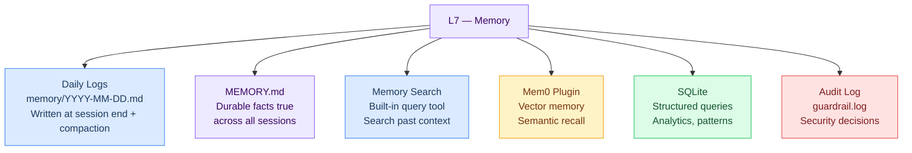

### The 4 Memory Methods

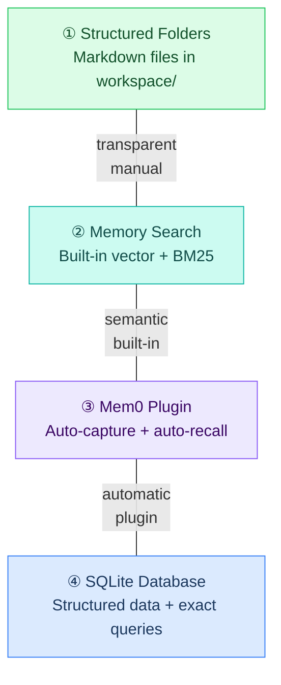

### How They Layer Together

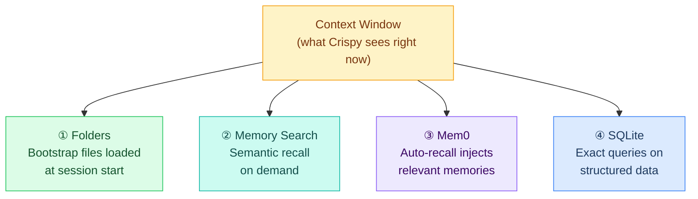

### Session Lifecycle

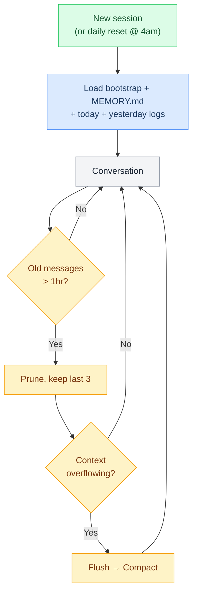

### Setup Priority

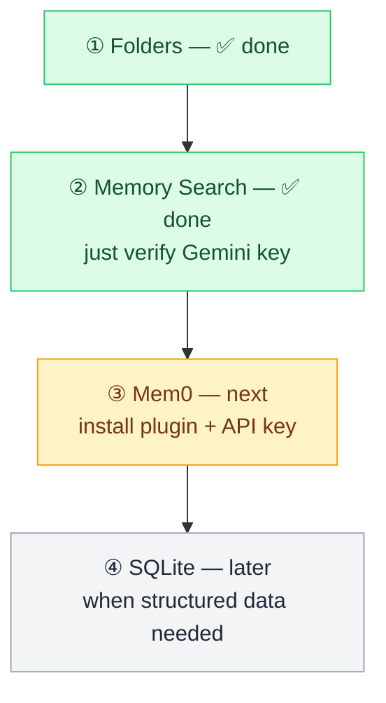

### Write Triggers

When does Crispy write to memory?

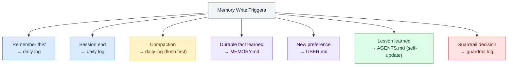

### Read Flow

When Crispy needs past context:

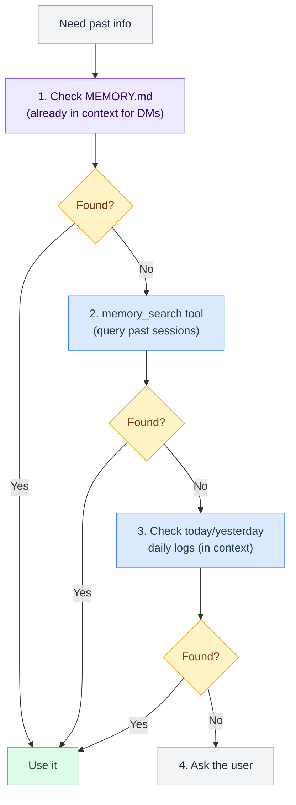

### Audit Log — Tool Call Flow

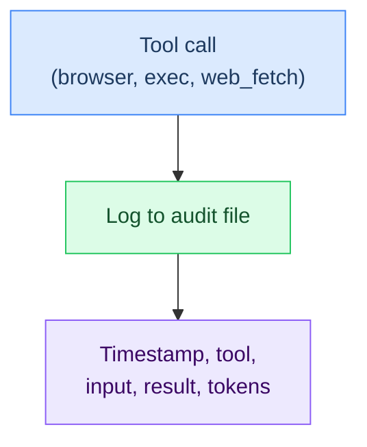

### How Audit Logs Feed Back into Guardrails

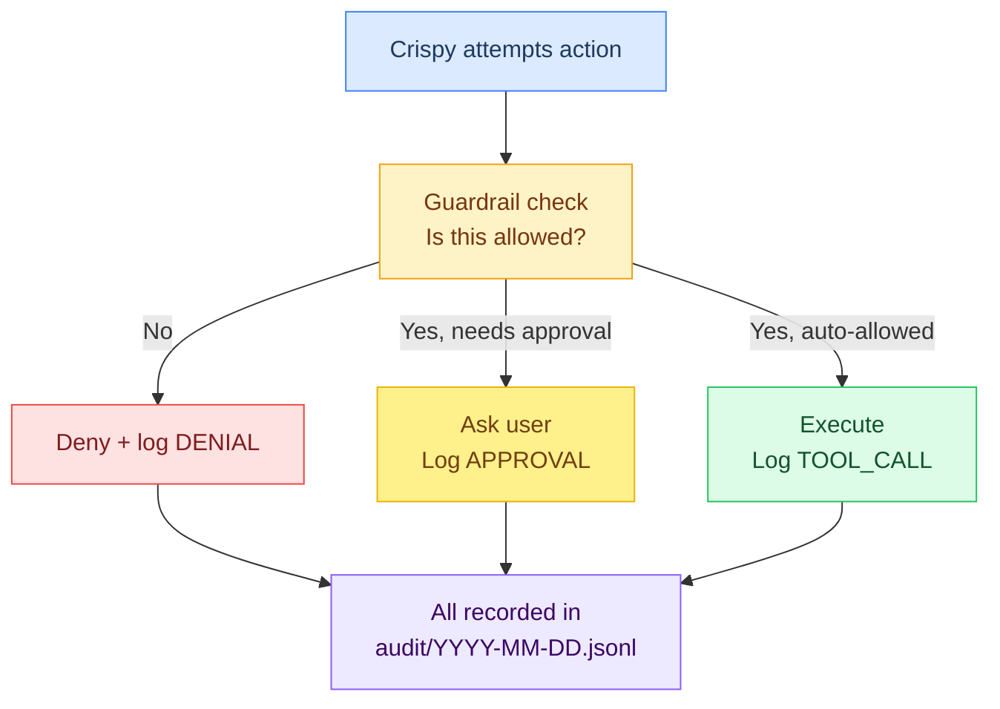

### When to Use SQLite vs Other Methods

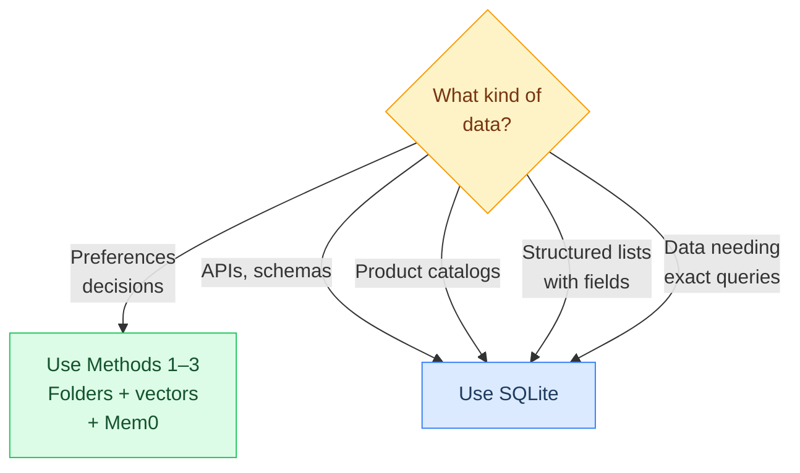

### How SQLite Works

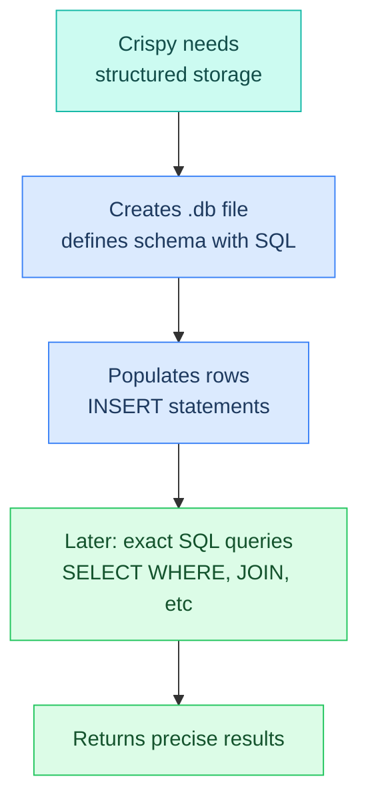

### Memory Storage Schema (ER Diagram)

How the five storage entities relate. Each entity maps to a physical file or index in the workspace.

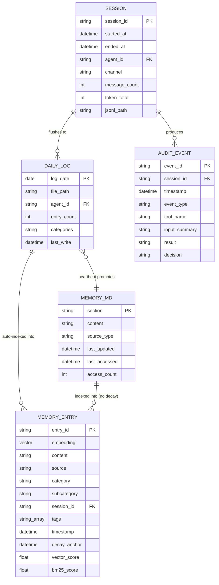

| Entity | Physical Storage | Retention | Query Method |
|---|---|---|---|
| **SESSION** | `sessions/YYYY-MM-DD.jsonl` | 90 days | File read |
| **DAILY_LOG** | `memory/YYYY-MM-DD.md` | Permanent (older archived) | File read + vector search |
| **MEMORY_ENTRY** | Embedding index (Gemini vectors) | 50K max, 30-day decay | `memory_search` tool |
| **MEMORY_MD** | `workspace/MEMORY.md` | Permanent (audit at 180d) | Loaded into context |
| **AUDIT_EVENT** | `audit/YYYY-MM-DD.jsonl` | 90 days | File read |

### Memory Decay Timeline

How memory relevance fades over time. MEMORY.md entries are exempt — they persist at full strength until manually archived.

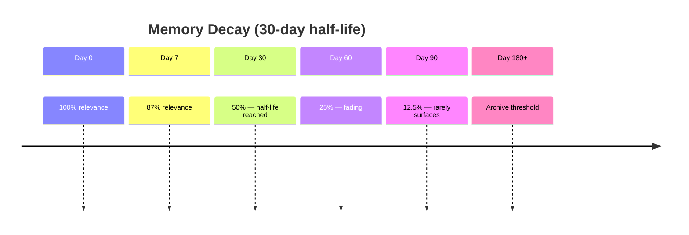

| Age | Score | What Happens |
|---|---|---|
| Day 0 | 100% | New memory indexed, vector + BM25 at full weight, daily log in active context |
| Day 7 | 87% | Still very accessible, daily log searchable |
| Day 30 | 50% | Half-life reached, heartbeat may promote to MEMORY.md |
| Day 60 | 25% | Only strong semantic matches surface |
| Day 90 | 12.5% | Rarely surfaces, session JSONL eligible for cleanup |
| Day 180+ | Archive | Daily logs archived, MEMORY.md entries audited |

> **MEMORY.md entries are exempt from decay** — they persist at full score until manually archived.

---

## L7 File Review (Live)

```dataview
TABLE WITHOUT ID
  file.link AS "File",
  choice(contains(file.frontmatter.tags, "status/finalized"), "✅",
    choice(contains(file.frontmatter.tags, "status/review"), "🔍",
      choice(contains(file.frontmatter.tags, "status/planned"), "⏳", "📝"))) AS "Status",
  choice(contains(file.frontmatter.tags, "type/guide"), "Guide", "Core") AS "Type",
  dateformat(file.mtime, "yyyy-MM-dd") AS "Last Modified"
FROM "stack/L7-memory"
WHERE file.name != "_overview"
SORT choice(contains(file.frontmatter.tags, "type/guide"), "Z", "A") ASC, file.name ASC
```

> **Key Decision: SSD as Vector Database** — The 870 EVO (1TB SATA SSD) can host a dedicated Qdrant vector DB for all of L7's memory search needs. See [[stack/L1-physical/hardware#priority-3--ssd-vector-database-free-just-needs-setup]] for setup instructions.

**Legend:** ✅ Finalized · 🔍 Review · 📝 Draft · ⏳ Planned

---

**Up →** [[stack/_overview]]
