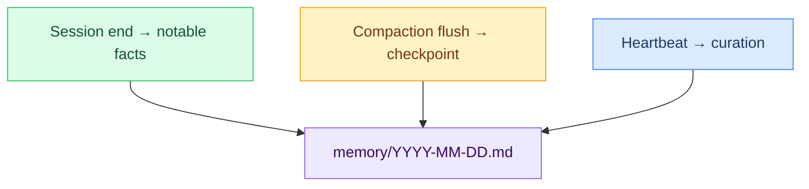

# L7 — Daily Memory Logs

> Append-only daily logs at `workspace/memory/YYYY-MM-DD.md`. Loaded at session start. Older logs searchable via Gemini embeddings with 30-day decay.

**Up →** [[stack/L7-memory/_overview]]

---

## Overview

Daily logs capture what happened in each session — decisions, facts discovered, user preferences, action items. They're written by Crispy at three key moments:



---

## File Format

**Location:** `workspace/memory/YYYY-MM-DD.md`

Each day gets one file. Files are append-only — Crispy adds entries without overwriting.

```
workspace/memory/
├── 2026-03-01.md    ← today (loaded at session start)
├── 2026-02-28.md    ← yesterday (also loaded)
├── 2026-02-27.md    ← searchable via vector search
└── ...
```

---

## What Gets Loaded

| File | When | Use Case |
|---|---|---|
| **Today's log** | Every DM session | Working context — what Crispy accomplished/decided today |
| **Yesterday's log** | Every DM session | Short-term continuity — what was planned yesterday |
| **Older logs** | Only via `memory_search` | Finding past conversations, decisions, patterns (with 30-day decay) |

> Bootstrap loads today + yesterday at session start. Older logs only surface via semantic search.

---

## Write Triggers

### 1. Session End (automatic)
When a session closes (user idle 2hrs, manual `/reset`, or 4am daily reset), Crispy appends a checkpoint:

```markdown
## [Time] — Session End

**Objective:** [what was being worked on]
**Progress:**
- [fact 1]
- [fact 2]
- [action item 1]

**Files Modified:** [list]
**Branch:** [current git branch if applicable]
**Blockers:** [any issues]
```

### 2. Compaction Flush (during overflow)
When context exceeds limits, memory flush writes before pruning:

```markdown
## [Time] — Compaction Checkpoint

**Summary:** [high-level progress]

**Key Decisions Made:**
- [decision 1]
- [decision 2]

**User Preferences Discovered:**
- [preference 1]

**Action Items:**
- [ ] [item]
- [ ] [item]
```

### 3. Heartbeat Curation (every 20 min)
Periodic checks may surface insights worth capturing:

```markdown
## [Time] — Heartbeat Note

**Pattern Noticed:** [observation]

**Worth Remembering:** [insight]
```

---

## What Gets Logged

### Facts
Clear, factual statements that survive daily log rotation:

```markdown
- Marty prefers TypeScript over Python for new projects
- Primary model: `researcher` (direct Anthropic key); fallbacks via OpenRouter — see [[stack/L2-runtime/config-reference]] for model strings
- Workspace is at ~/openclaw/
```

### Decisions
Project/product decisions that affect future work:

```markdown
- Decided to postpone SQLite implementation to next phase
- Chose Mem0 cloud (not self-hosted) for privacy vs complexity tradeoff
```

### User Preferences
Communication, tool, or workflow preferences:

```markdown
- Marty prefers tight, concise output — avoid verbose explanations
- Always suggest `git stash` before switching branches
- Use `openclaw doctor` first when debugging errors
```

### Action Items
Explicit next steps:

```markdown
- [ ] Write L7-memory bootstrap files (6 sub-pages)
- [ ] Test memory search with real query
- [ ] Update CONFIG to fix circular fallback
```

### Questions & Unknowns
When clarification is needed:

```markdown
**Question:** Should Mem0 replace MEMORY.md curation, or supplement it?
**Unknown:** Whether self-hosted Mem0 + Qdrant can fit on desktop's 64GB RAM
```

---

## Example Daily Log Entry

```markdown
# 2026-03-02 — Crispy Kitsune Daily Log

## 09:15 — Morning Session

**Objective:** Write L7-memory sub-pages (6 new docs)

**Progress:**
- Read legacy source files (memory-daily.md, MEMORY.md template, memory-schema.md)
- Reviewed memory-search.md, mem0.md, sqlite.md
- Started daily-logs.md documentation

**Key Discovery:** 30-day decay curve for vector search is computed at query time, not at index time. Older memories naturally score lower — no cleanup needed.

**Files Modified:** stack/L7-memory/daily-logs.md (in progress)

**Branch:** main

**Blockers:** None yet

---

## 14:30 — Compaction Checkpoint

**Summary:** Completed 4 of 6 L7 sub-pages. Framework clear, examples drafted.

**Key Decisions Made:**
- Format each sub-page with Mermaid diagrams and config examples
- Include "Implementation Status" for methods not yet live (Mem0, SQLite)
- Link each back to _overview and prereq files

**User Preferences Discovered:**
- Marty wants real config blocks in every guide (not just theory)
- Prefers absolute file paths in responses

**Action Items:**
- [ ] Write memory-md.md (MEMORY.md bootstrap)
- [ ] Write memory-search.md (vector + BM25 hybrid)
- [ ] Write mem0.md (auto-capture plugin)
- [ ] Write sqlite.md (structured data)
- [ ] Write audit-log.md (action trail)
- [ ] Test all files load in Obsidian vault

---

## 16:45 — Session Close

**Completed:** Reviewed all source materials. Created framework for all 6 pages.

**Questions for Next Session:** Should audit logs also track tool costs (tokens, API calls)?

---
```

---

## Retention & Cleanup Rules

| Rule | Trigger | Action |
|---|---|---|
| **Keep today's log** | Always | Loaded each session |
| **Keep yesterday's log** | Always | Loaded each session |
| **Search logs 3–30 days old** | Vector search | Available with 30-day decay |
| **Archive logs > 30 days** | Automatic cleanup | Move to `memory/archive/` if storage becomes constrained |
| **Prune if > 10MB total** | Automatic (at session reset) | Archive oldest entries to free space |

> Most memories > 30 days old are already faded in the vector index (50% score at 30d, 25% at 60d). Archiving won't break searches.

---

## Config

> Config source of truth: [[stack/L7-memory/config-reference]] `^config-memory` for memory search settings. Compaction and heartbeat configs owned by L2 — see [[stack/L2-runtime/config-reference]].

---

## Usage Tips

1. **Search for past decisions:** `openclaw memory search "did we decide about X?"`
2. **Check daily log size:** `wc -w workspace/memory/$(date +%Y-%m-%d).md`
3. **Archive manually:** Move old logs to `workspace/memory/archive/YYYY-MM-DD.md`
4. **Reindex embeddings:** `openclaw memory reindex` (if embeddings seem stale)

---

**Related →** [[stack/L7-memory/_overview]] · [[stack/L7-memory/memory-search]] · [[stack/L7-memory/memory-md]]

**Up →** [[stack/L7-memory/_overview]]
