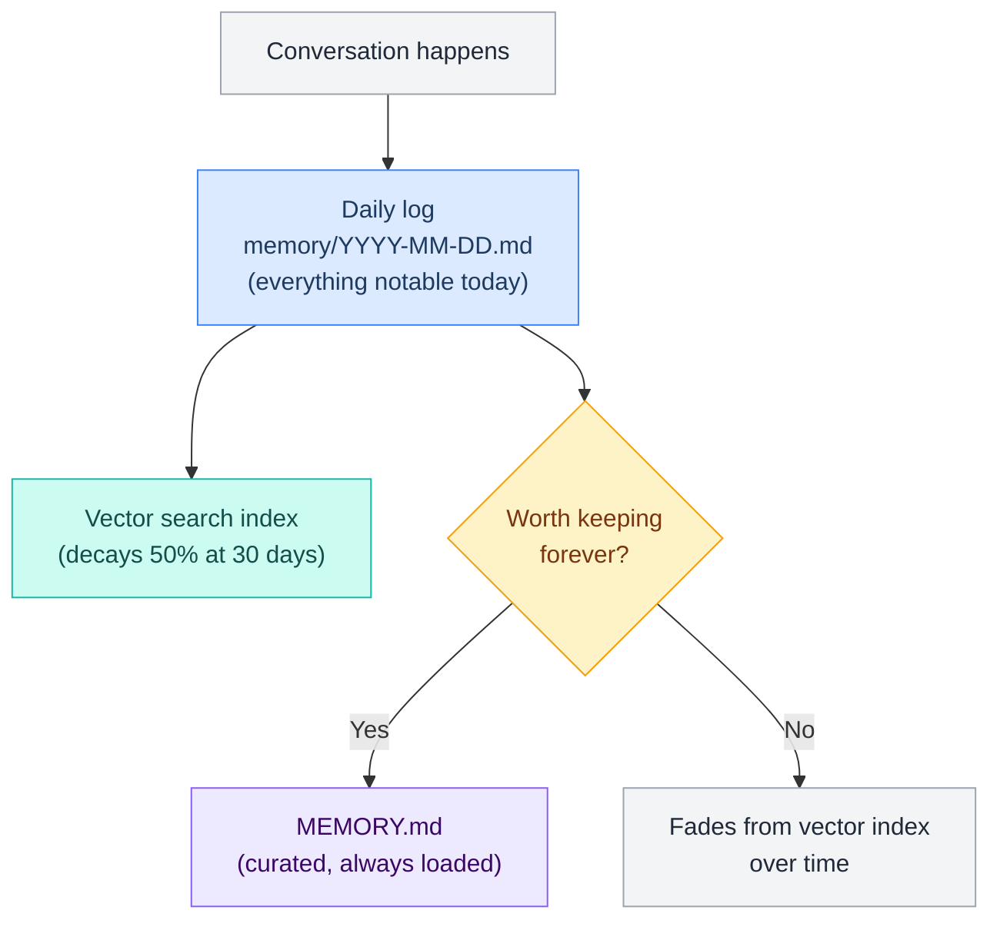
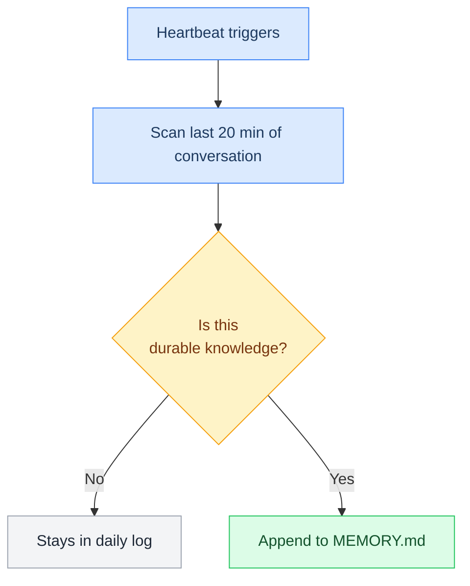
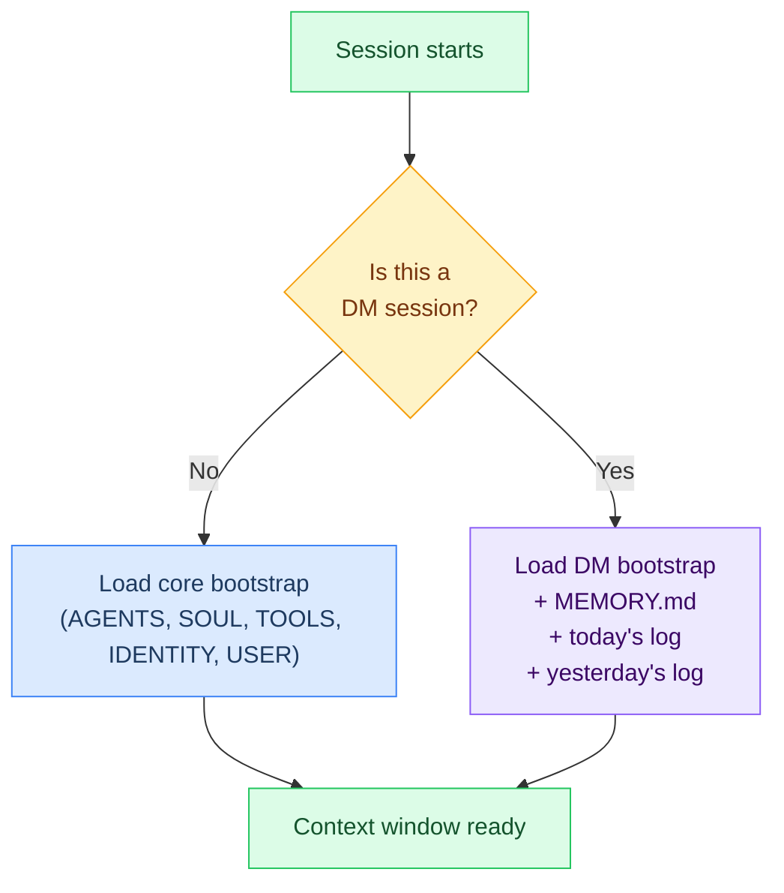

# L7 — MEMORY.md (Long-Term Curated Memory)

> The "too important to forget" file. Crispy's curated long-term knowledge loaded into every DM session. Grows organically over time. Not transient like daily logs.

---

## What is MEMORY.md?



**Key difference:** Unlike daily logs (which rotate every 30 days), MEMORY.md stays forever. It's a living document that Crispy writes to during curation tasks and when explicitly told "remember this."

---

## File Location & Lifecycle

| Property | Value |
|---|---|
| **Path** | `~/.openclaw/workspace/MEMORY.md` |
| **Lifecycle** | Persistent (grows over time) |
| **Loaded every session?** | ✅ Yes — in every DM session |
| **Synced to GitHub?** | ✅ Yes — part of workspace |
| **Who can edit?** | Crispy (automatic curation) + Marty/Wenting (manual edits) |

---

## What Does NOT Go Here

To keep MEMORY.md focused, these belong elsewhere:

| Content Type | Goes Where | Reason |
|---|---|---|
| Today's task progress | Daily logs | Transient, will age out |
| Timezone, home city, location | USER.md | Personal info, not memory |
| Personality, values, communication style | SOUL.md | Identity, not learned facts |
| Tool descriptions, API keys, secrets | TOOLS.md | Configuration, not memory |
| Heartbeat notes, session checkpoints | Daily logs | Working context |

---

## What Makes Something "MEMORY.md-worthy"?

A fact should be promoted to MEMORY.md if it meets **most** of these:

- ✅ **True across sessions** — not just today's context
- ✅ **Affects behavior** — changes how Crispy should respond or work
- ✅ **Won't be re-asked** — Crispy should never ask again
- ✅ **Would be weird to forget** — feels wrong to lose it
- ✅ **Survives 30-day decay** — important enough to keep past the daily log rotation

### Examples

**YES — add to MEMORY.md:**
```markdown
- Marty prefers TypeScript over Python for new projects
- Primary model: `researcher` (direct Anthropic key); fallbacks via OpenRouter — see [[stack/L2-runtime/config-reference]] for model strings
- Decision: Decided to postpone SQLite until Phase 2
- Architecture: Bootstrap files live in ~/.openclaw/workspace/, NOT in ~/.openclaw/skills/
```

**NO — leave in daily logs:**
```markdown
- Completed 3 of 6 L7-memory sub-pages today
- Debugged config error in memorySearch section
- Fixed circular fallback in model.fallbacks array
- Session duration: 4 hours 23 minutes
```

---

## How Crispy Writes Here

### 1. Heartbeat Curation (every 20 min)
Periodic check scans recent conversation and promotes lasting insights:



### 2. Explicit Request
When user says "Crispy, remember..." or "Add this to memory":

```
User: "Crispy, remember that we decided to use SQLite for the endpoints catalog"
Crispy: "Noted. I'll add this to MEMORY.md."
```

### 3. Compaction Flush
Before context gets trimmed, key durable facts get promoted:

```
[Context nearing limit]
→ Memory flush writes to daily log
→ Heartbeat reviews and promotes durable facts to MEMORY.md
```

### 4. Session End
Anything from today's session with cross-session relevance:

```
[Session closes]
→ Daily log written
→ Next heartbeat checks for promotable facts
```

---

## Structure & Sections

```markdown
# Crispy — Long-Term Memory

> Last curated: [date]

## People

### Marty (primary admin)
<!-- Key facts Crispy learns about Marty over time -->
- Prefers TypeScript over Python for new projects
- Likes concise, tight output — avoid verbose explanations
- Works on custom PC water-cooling loop (hobby)

### Wenting (co-admin)
<!-- Key facts about Wenting -->
- Prefers direct, technical answers
- Handles financial aspects of projects

## Projects

### OpenClaw (Crispy Kitsune)
<!-- Architecture decisions, setup choices affecting future work -->
- 3-tier model architecture: `researcher` → `workhorse` → `workhorse-code` → fallbacks via OpenRouter — see [[stack/L2-runtime/config-reference]] for model strings
- Bootstrap files: `~/.openclaw/workspace/` (not `~/.openclaw/skills/`)
- Session reset: 4am Pacific, also on 2hr idle
- Memory search: Gemini embeddings with 30-day decay

### [Other Projects]
- [Project decisions and context]

## Patterns & Preferences

<!-- Cross-session patterns Crispy notices -->
- When debugging, check `openclaw doctor` output first
- Git workflows: always `stash` before switching branches unless explicitly kept
- Always verify Gemini API key works after bootstrap

## Important Decisions

<!-- Decisions that shouldn't be re-asked -->
- Mem0 plugin: cloud (app.mem0.ai), not self-hosted
- Config audit fixes: 6 issues identified, fix order documented
- SQLite: defer to Phase 2 (not urgent)
```

---

## Config Integration

MEMORY.md is loaded into L4 (context layer) via the bootstrap system:

```json5
// [[stack/L2-runtime/config-reference]] §3c — Bootstrap
"agents.defaults": {
  "skipBootstrap": false,      // 🔴 Must be FALSE to load
  "bootstrapMaxChars": 50000   // Total size limit for all bootstrap files
}

// MEMORY.md is one of 5 core bootstrap files:
// AGENTS.md, SOUL.md, TOOLS.md, IDENTITY.md, USER.md, MEMORY.md (DM-only)
```

**Load sequence:**



---

## Manual vs Auto Updates

| Update Type | Who | When | Example |
|---|---|---|---|
| **Auto (heartbeat)** | Crispy | Every 20 min | Promotes durable facts from daily log |
| **Auto (user request)** | Crispy | Anytime user says "remember..." | Adds fact to MEMORY.md immediately |
| **Manual (admin)** | Marty/Wenting | Anytime | Direct edits to fix, reorganize, clarify |

**Best practice:** Crispy writes facts as-is; Marty can polish them during reviews.

---

## Size Limits & Maintenance

| Limit | Value | Consequence |
|---|---|---|
| **Max MEMORY.md size** | 50,000 chars (set in `bootstrapMaxChars`) | If exceeded, oldest sections get archived |
| **Max loaded per session** | ~30KB | Usually well under limit |
| **Archive trigger** | > 60KB | Move old sections to `memory/MEMORY-archive-YYYY-MM.md` |

> MEMORY.md rarely gets large. Most projects accumulate 5–15KB of real memories before hitting archive thresholds.

---

## Example: Fully Populated MEMORY.md

```markdown
# Crispy — Long-Term Memory

> Last curated: 2026-03-02 by heartbeat

## People

### Marty (primary admin)
- Prefers TypeScript for new projects (Python only for quick scripts)
- Likes tight, concise output — verbose explanations waste time
- Water-cooling loop project on desktop build (hobby, mentioned in passing)
- Sets the vision; Wenting handles execution/finances
- Tests code before asking Crispy to review — values working examples

### Wenting (co-admin)
- Prefers direct, technical answers without preamble
- Handles financial tracking for OpenClaw project
- Works on parallel team projects

## OpenClaw Project

### Architecture & Setup
- 3-tier model architecture: `researcher` → `workhorse` → `workhorse-code` → fallbacks via OpenRouter — see [[stack/L2-runtime/config-reference]] for model strings
- Bootstrap files location: `~/.openclaw/workspace/` (NOT `~/.openclaw/skills/`)
- Session reset: 4am Pacific, also after 2 hours idle
- Memory index: Gemini embeddings, 30-day half-life decay

### Memory System
- Method 1: Structured folders (AGENTS, SOUL, etc.)
- Method 2: Memory Search (built-in, Gemini vectors)
- Method 3: Mem0 plugin (cloud version, decided not self-hosted)
- Method 4: SQLite (deferred to Phase 2)

### Config & Decisions
- Adopted 3-tier model architecture: researcher (primary) + workhorse + workhorse-code + fallbacks
- Fixed fallback chain: researcher → workhorse (sonnet) → workhorse-code (gpt-5.2) → deepseek-r1 → deepseek-v3.2 → flash → free (no loops)
- Extended thinking enabled on primary model at "high" level
- ElevenLabs model aligned to `eleven_v3`
- Decided: Mem0 cloud (simplicity over self-hosting privacy)
- Decided: SQLite implementation deferred (not urgent for Phase 1)

## Patterns & Lessons Learned

### Debugging
- Always run `openclaw doctor` first — catches 80% of issues
- Check gateway logs before checking individual component logs
- Memory search may surface irrelevant results occasionally — it learns over time

### Git Workflow
- Always `git stash` before branch switch unless explicitly keeping changes
- Commit before context pruning (compaction triggers checkpoint)
- Use `git status` to verify workspace state before major operations

### Communication
- Marty values working examples over theory
- Tight formatting beats detailed explanation
- List action items explicitly (checkbox format)

## Technical Preferences

- TypeScript as default for new projects
- Commits should reference decisions, not just what changed
- Always suggest verification steps after making changes
- Use absolute paths in responses (no relative paths)

## Cross-Project Context

- OpenClaw is Marty's primary AI agent framework
- Crispy Kitsune is the reference implementation
- Project lives at ~/Crispy-Project/ with docs in Obsidian vault
```

---

## Curation Policies

### Keep / Discard Decision Table

| Signal | Keep? | Reason |
|---|---|---|
| Fact is still true today | ✅ Keep | Still valid |
| Fact was true 90+ days ago but never referenced since | ⚠️ Review | May be stale |
| Fact was true but has been superseded by a newer decision | ❌ Discard | Outdated — replace with new fact |
| Fact is a one-time event ("fixed X on Y date") | ❌ Discard | Not durable — belongs in daily log |
| Fact affects how Crispy should behave in every session | ✅ Keep | High value |
| Fact is a project detail that will change with the next release | ⚠️ Review | Version-pin it or remove |
| Fact is already in AGENTS.md / SOUL.md / USER.md | ❌ Discard | Duplicate — remove from MEMORY.md |
| Fact is a preference Marty/Wenting stated explicitly | ✅ Keep | User intent — never discard without asking |
| Fact is an assumption Crispy inferred | ⚠️ Review | Confirm before keeping |
| Fact is a cross-session architecture decision | ✅ Keep | Decision log value |

**Rule of thumb:** If Crispy would behave differently without this fact, keep it. If it just describes what happened that day, discard it.

---

### Aging Policy

Entries don't expire automatically — but each monthly audit applies these rules:

| Age | Rule |
|---|---|
| **< 30 days** | Keep unconditionally |
| **30–90 days** | Keep if still referenced or behaviorally relevant |
| **90–180 days** | Review: confirm still true, still affecting behavior |
| **> 180 days** | Default to archive unless it's a core preference or architecture decision |
| **> 1 year** | Move to `memory/MEMORY-archive-YYYY.md` unless still actively relevant |

**Archive rule:** Entries move to archive when they're no longer used to inform current decisions, but may be historically interesting. Entries are deleted when they were wrong, superseded, or purely transient.

---

### Tag Taxonomy

Every MEMORY.md entry should be mentally categorized (inline tags are optional but help during audits):

| Tag | Meaning | Example |
|---|---|---|
| `#preference` | User-stated preference that affects all future interactions | "Prefers TypeScript over Python" |
| `#decision` | A cross-session architectural or product decision | "Decided Mem0 cloud, not self-hosted" |
| `#architecture` | A structural fact about the system that rarely changes | "Bootstrap files live in ~/.openclaw/workspace/" |
| `#person` | A fact about a person (admin, collaborator) | "Wenting handles financial tracking" |
| `#project` | A fact tied to a specific project | "SQLite deferred to Phase 2" |
| `#lesson` | Something learned from debugging or failure | "Always run openclaw doctor first" |
| `#pattern` | A recurring behavioral pattern worth remembering | "Marty always tests before asking for review" |
| `#constraint` | A hard limit or rule that must not be violated | "Never commit to main without staging verification" |

Tags are optional — don't add clutter. Use them when curating to identify which category an entry falls into, especially during audits to see if a section is imbalanced.

---

## When to Review & Archive

- **Monthly:** Marty reviews MEMORY.md during a 15-minute audit
- **If > 40KB:** Start moving oldest sections to archive
- **If unclear:** Ask user if something is still true before keeping

---

**Related →** [[stack/L7-memory/memory-search]] · [[stack/L7-memory/daily-logs]] · [[stack/L7-memory/_overview]]

**Up →** [[stack/L7-memory/_overview]]
