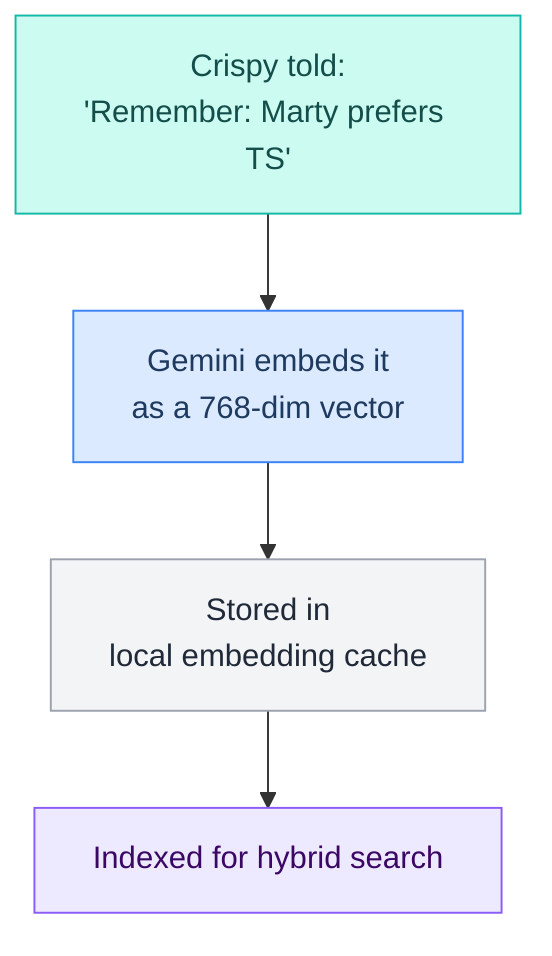
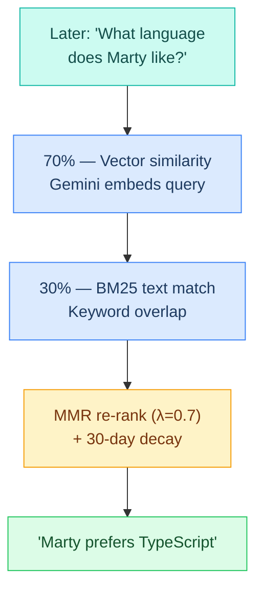
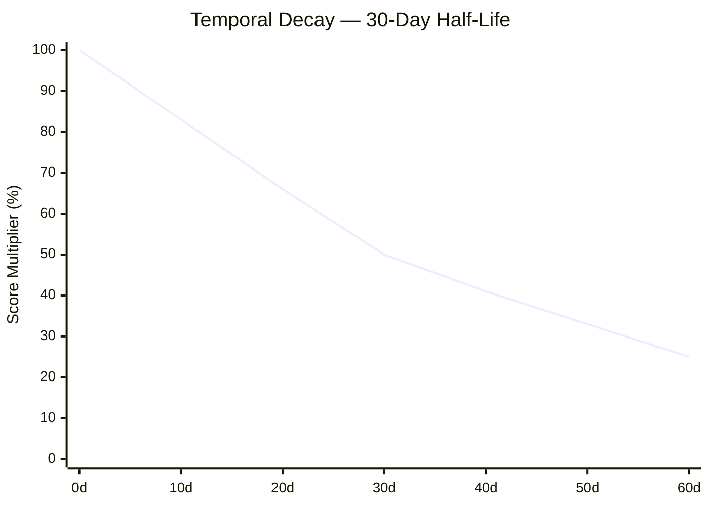
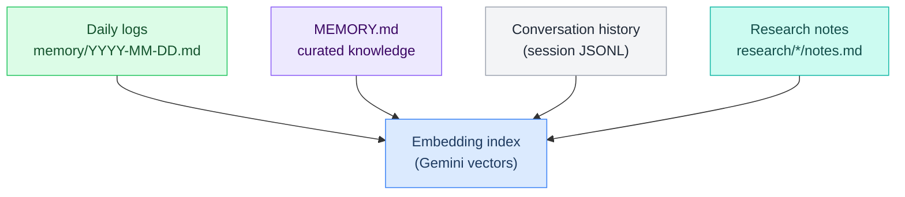
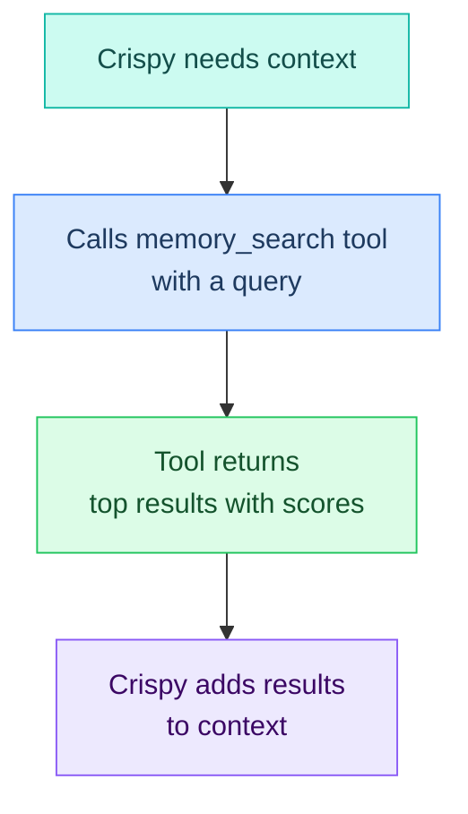
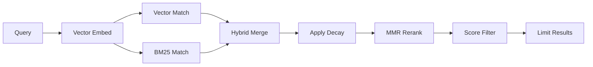

# L7 — Memory Search (Vector + BM25 Hybrid)

> Built-in semantic search tool. Stores memories as vector embeddings and retrieves with hybrid matching. Gemini embeddings with 30-day temporal decay.

**Up →** [[stack/L7-memory/_overview]]

---

## How Memory Search Works



**Retrieval (search time):**



---

## Search Algorithm

| Component | Weight | What It Does |
|---|---|---|
| **Vector similarity** | 70% | Gemini embeds query and compares to stored embeddings semantically |
| **BM25 text match** | 30% | Keyword/phrase overlap — catches exact terms vectors might miss |
| **MMR re-ranking** | λ=0.7 | Maximal Marginal Relevance — reduces duplicate/redundant results |
| **Temporal decay** | 30-day half-life | 50% score at 30d, 25% at 60d, older memories naturally fade |

### Temporal Decay Curve



**How it works:** At query time, results from 30 days ago are scored at 50%. No cleanup or archival needed — decay is computed on-the-fly.

---

## What Gets Indexed



| Source | Indexing | Searchable | Purpose |
|---|---|---|---|
| **Daily logs** | Automatic (at write) | ✅ 30+ days with decay | Conversation history, decisions |
| **MEMORY.md** | Automatic | ✅ Always (no decay) | Permanent knowledge |
| **Session JSONL** | Automatic | ✅ During session | Active conversation context |
| **Research notes** | Optional | ✅ If enabled | Past research findings |

---

## Config

**Requires:** Gemini API key (or OpenAI/Voyage for embeddings)

> Config source of truth: [[stack/L7-memory/config-reference]] `^config-memory`

```json5
// [[stack/L2-runtime/config-reference]] §3d — Memory & Compaction
"agents.defaults.memorySearch": {
  "enabled": true,
  "provider": "gemini",              // "gemini" | "openai" | "voyage"
  "model": "gemini-embedding-001",   // embedding model
  "hybrid": {
    "vectorWeight": 0.7,             // semantic similarity weight
    "textWeight": 0.3                // keyword match weight
  },
  "decay": {
    "halfLifeDays": 30               // 50% score at 30 days old
  },
  "cache": {
    "maxEntries": 50000              // max stored embeddings
  }
}

// [[stack/L2-runtime/config-reference]] §2 — Models (Gemini key)
"models.providers.google": {
  "apiKey": "${GEMINI_API_KEY}"      // 🔴 REQUIRED for embeddings
}
```

### Alternative Embedding Providers

```json5
// OpenAI embeddings (if you have OpenAI key)
"agents.defaults.memorySearch": {
  "provider": "openai",
  "model": "text-embedding-3-small"
}

// Voyage AI embeddings
"agents.defaults.memorySearch": {
  "provider": "voyage",
  "model": "voyage-2"
}
```

---

## How Crispy Uses It



| Trigger | Query | Purpose |
|---|---|---|
| User asks "What did we decide about X?" | "X decision" | Retrieve past decision |
| Working on related task | "similar task from past" | Find related context |
| Starting research | "did we research this before?" | Avoid duplicate effort |
| Heartbeat curation | "durable facts worth keeping" | Promote to MEMORY.md |

---

## Usage Examples

### Example 1: Retrieve a Past Decision

```
User: "What model did we decide to use for the memory search?"
Crispy: Let me check our memory...
→ memory_search("model decision for memory search")
→ Returns: "Decided to use Gemini embeddings (text-embedding-3-small not available; Gemini cheaper)"
```

### Example 2: Find Related Research

```
User: "I want to explore another Mem0 alternative"
Crispy: Let me check if we've researched this before...
→ memory_search("memory tools comparison auto-capture")
→ Returns: "Mem0 vs vector search tradeoffs: Mem0 is passive (auto-captures), Memory Search is on-demand"
```

### Example 3: Check if Question Was Already Answered

```
User: "Should we use cloud or self-hosted Mem0?"
Crispy: [checks memory]
→ memory_search("Mem0 cloud self-hosted decision")
→ Returns: "Decided: Mem0 cloud (simplicity vs self-hosting privacy tradeoff)"
```

---

## CLI Commands

```bash
# Test a search (returns formatted results)
openclaw memory search "test query"

# Example output:
# Match 1: "Marty prefers TypeScript for new projects" (score: 0.87, age: 5d)
# Match 2: "TypeScript backend, Python scripts" (score: 0.72, age: 15d)

# Get memory index stats
openclaw memory stats
# Total entries: 342
# Index size: 2.3 MB
# Oldest entry: 2026-02-15 (45 days)
# Decay half-life: 30 days

# Rebuild embeddings (if stale)
openclaw memory reindex
```

---

## Limitations & Gotchas

| Gotcha | Impact | Workaround |
|---|---|---|
| Requires embedding provider | Won't work without Gemini/OpenAI/Voyage key | Set up key before first search |
| Only searches what's explicitly saved | Won't auto-capture passive context | Use Mem0 plugin for auto-capture |
| 30-day decay fades old memories | Loses context > 60 days ago | Promote important facts to MEMORY.md |
| Vector similarity can be fuzzy | Might return semantically close but not exact matches | Use BM25 weight for keyword searches |
| Index lives locally | No cloud backup (unless synced to GitHub) | Back up embedding cache regularly |

---

## Performance Characteristics

| Operation | Time | Notes |
|---|---|---|
| Search (Gemini embed) | ~500ms | Network call to Gemini |
| BM25 matching | ~50ms | Local computation |
| Full re-ranking | ~100ms | Local, MMR calculation |
| **Total query latency** | **~650ms** | Usually invisible to user |
| Index size (50K entries) | ~2.3 GB | Compressed vector embeddings |

> Memory search is fast enough for every Crispy response. No artificial delays needed.

---

## Status: ✅ Configured

Memory Search is already integrated and ready to use. Just verify the Gemini API key works:

```bash
openclaw memory search "test"
# Should return results, not errors
```

If key is missing or invalid:
```
Error: Gemini API key not set. Add to .env: GEMINI_API_KEY=...
```

---

## Tuning (Advanced)

If search results feel off:

```json5
// Increase vector weight if you want more semantic matching
"hybrid": {
  "vectorWeight": 0.8,   // was 0.7
  "textWeight": 0.2      // was 0.3
}

// Decrease decay half-life if older memories should fade faster
"decay": {
  "halfLifeDays": 14     // was 30 — older memories fade in 2 weeks
}

// Reduce cache size if storage is constrained
"cache": {
  "maxEntries": 25000    // was 50000 — stores fewer embeddings
}
```

---

## Search API Contract

> Formal input/output schema for the `memory_search` tool. Consumed by [[stack/L5-routing/_overview|L5 routing]] for memory filtering decisions.

### Request Schema

```json5
// Tool call: memory_search
{
  "query": "string",            // Natural language search query (required)
  "limit": 5,                   // Max results to return (default: 5, max: 20)
  "min_score": 0.3,             // Minimum relevance threshold (0.0–1.0, default: 0.3)
  "sources": ["all"],           // Filter by source: "all" | "daily_logs" | "memory_md" | "session" | "research"
  "decay": true                 // Apply 30-day temporal decay (default: true; false for MEMORY.md lookups)
}
```

### Response Schema

```json5
{
  "results": [
    {
      "content": "string",       // The matched text snippet (≤500 chars)
      "score": 0.87,             // Combined relevance score (0.0–1.0) after hybrid ranking + decay
      "source": "daily_logs",    // Origin: "daily_logs" | "memory_md" | "session" | "research"
      "file": "memory/2026-03-01.md",  // Source file path
      "age_days": 3,             // Days since content was written
      "vector_score": 0.91,      // Raw vector similarity (before weighting)
      "bm25_score": 0.78         // Raw BM25 keyword score (before weighting)
    }
  ],
  "total_matches": 12,           // Total matches before limit applied
  "query_tokens": 8,             // Tokens used for embedding the query
  "latency_ms": 650              // End-to-end query time
}
```

### Scoring Formula

```
final_score = (vector_score × 0.7 + bm25_score × 0.3) × decay_multiplier × mmr_penalty
```

Where `decay_multiplier = 0.5 ^ (age_days / 30)` and `mmr_penalty` reduces scores for results too similar to already-selected results (λ=0.7).

### Search Scoring Pipeline (State Diagram)

The complete scoring pipeline from raw query to ranked results. Each state transforms the score until final ranking.



| Stage | Operation | Parameters |
|---|---|---|
| **Vector Embed** | Gemini encodes query | 768 dimensions, ~500ms |
| **Vector Match** | Cosine similarity vs stored vectors | Top candidates by semantic proximity |
| **BM25 Match** | Keyword/phrase overlap (parallel) | Term frequency scoring |
| **Hybrid Merge** | Weighted sum of both scores | 70% vector + 30% BM25 |
| **Apply Decay** | Temporal relevance penalty | `0.5^(age_days/30)` — MEMORY.md exempt |
| **MMR Rerank** | Penalize redundancy | λ=0.7 diversity factor |
| **Score Filter** | Drop low-confidence results | min_score = 0.3 |
| **Limit Results** | Return top N | Default 5 |

### L5 Integration Notes

L5 uses the search API for mode-aware memory filtering:

| L5 Mode | Typical Query Pattern | Suggested Parameters |
|---|---|---|
| **Coding** | "recent errors in {project}" | `sources: ["daily_logs", "session"], limit: 3` |
| **Research** | "past research on {topic}" | `sources: ["research", "memory_md"], decay: false` |
| **Chatting** | "preferences about {topic}" | `sources: ["memory_md"], decay: false, limit: 5` |
| **Briefing** | "key facts for {topic}" | `sources: ["all"], min_score: 0.5, limit: 10` |

---

---

## Category Metadata Schema (L5 Integration)

L5 focus modes use category-aware memory filtering via `^filter-{category}` blocks. The vector DB metadata schema supports this:

| Field | Type | Purpose |
|---|---|---|
| `category` | string | Primary focus category (cooking, coding, finance, etc.) |
| `subcategory` | string | Sub-domain within category (cooking:recipe, coding:deploy) |
| `timestamp` | ISO-8601 | When the memory was created |
| `session_id` | string | Session that produced this memory |
| `summary` | string | Compacted text content |
| `embedding` | vector | Gemini `gemini-embedding-001` 768-dim vector |
| `tags` | string[] | Supports dual-tagging for cross-category messages |
| `decay_anchor` | ISO-8601 | Anchor for 30-day temporal decay (may differ from timestamp) |

**Cross-category messages** are dual-tagged — a message like "I built a meal planner app" gets both `coding` and `cooking` tags, retrievable from either hat's `^filter-{slug}` block.

**Category persistence:** Smart detect — each session re-classifies from the first message. No carry-over state.

**Compaction:** Per-category-segment — mixed-topic sessions get independent summaries per category group.

**External vector DBs:** For custom RAG/knowledge base work beyond Crispy's session memory, see the qdrant-database-engineer skill (`.claude/skills/qdrant-database-engineer/SKILL.md`). That skill is for building external systems, not for Crispy's internal memory.

---

**Related →** [[stack/L7-memory/memory-md]] · [[stack/L7-memory/daily-logs]] · [[stack/L7-memory/_overview]]
