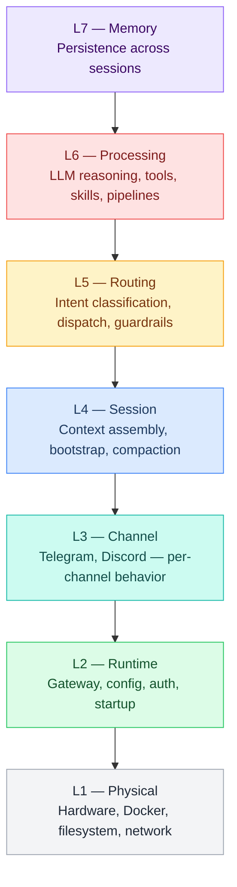
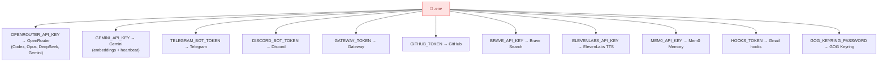
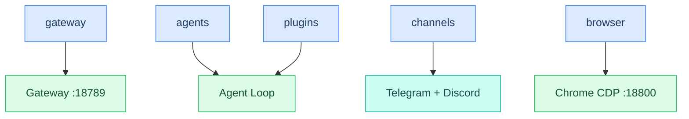
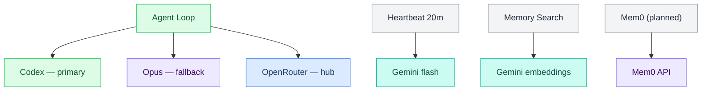
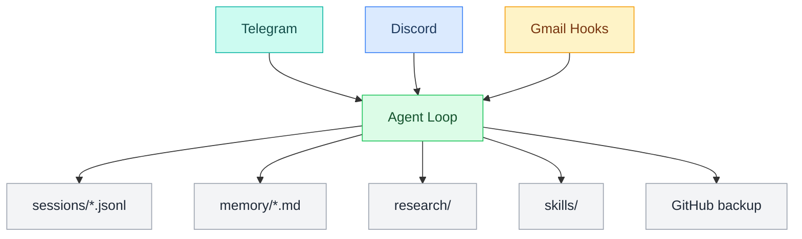
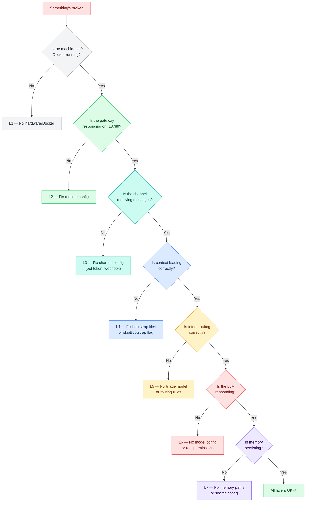

# Crispy Kitsune Stack (CKS)

> A 7-layer reference model for understanding how Crispy processes messages, inspired by the OSI networking model. Each layer has a single responsibility and only communicates with the layers directly above and below it.

**Pre-boot setup:** See [[build/README]] for environment configuration, API keys, workspace seeding, and plugin setup before Crispy's first boot.

## Contents

- [[#Diagrams]]
  - [[#The 7 Layers]] · `flowchart`
  - [[#Config Cascade — What Feeds What (Class Diagram)]] · `classDiagram`
- [[#Core Files vs Guides]]
- [[#Property Convention (Dataview Source of Truth)]]
- [[#Layer Reference]]
- [[#System Relationships]]
  - [[#Secrets → Services]] · `flowchart`
  - [[#Config → Runtime]] · `flowchart`
  - [[#Runtime → Providers]] · `flowchart`
  - [[#I/O → Storage]] · `flowchart`
  - [[#How a Message Flows Through the Stack]] · `flowchart`
- [[#OSI vs CKS Comparison]]
- [[#Layer Independence]]
- [[#Debugging with the Stack]] · `flowchart`
- [[#Guardrails Across Layers]]
- [[#Reading Order]]

---

## Diagrams

### The 7 Layers



### Config Cascade — What Feeds What (Class Diagram)

How the five build scaffolds pull from layer source files and produce deploy artifacts. Each scaffold is a manifest — it never contains content directly.

```mermaid
classDiagram
    class ConfigMain {
        +scaffold: build/config-main.md
        +pattern: ^config-*
        +output: dist/openclaw.json
        +sources: L1 L2 L3 L6 L7 config-reference.md
    }

    class ContextMain {
        +scaffold: build/context-main.md
        +pattern: ^ctx-*
        +output: dist/context-files/*.md
        +sources: L4 context-files/*.md
    }

    class EnvMain {
        +scaffold: build/env-main.md
        +pattern: ^env-*
        +output: dist/.env.example
        +sources: self-contained
    }

    class PipelineMain {
        +scaffold: build/pipeline-main.md
        +pattern: ^pipeline-*
        +output: dist/pipelines/*.lobster
        +sources: L6 pipelines/*.md + coding/*.md + L5 categories/*/pipelines.md
    }

    class FocusMain {
        +scaffold: build/focus-main.md
        +pattern: ^mode-* ^tree-* ^triggers-* ^filter-* ^compaction-* ^speed-*
        +output: dist/focus/{category}/*
        +sources: L5 categories/*/*.md
    }

    class L1_Config {
        +file: stack/L1-physical/config-reference.md
        +blocks: ^config-gateway ^config-hooks
    }

    class L2_Config {
        +file: stack/L2-runtime/config-reference.md
        +blocks: ^config-models ^config-agents ^config-browser
    }

    class L3_Config {
        +file: stack/L3-channel/config-reference.md
        +blocks: ^config-channels
    }

    class L6_Config {
        +file: stack/L6-processing/config-reference.md
        +blocks: ^config-tools ^config-plugins ^config-cron ^config-skills
    }

    class L7_Config {
        +file: stack/L7-memory/config-reference.md
        +blocks: ^config-memory ^config-audit
    }

    class BuildScript {
        +file: build/scripts/build-config.js
        +role: Assembler
        +reads: scaffold manifests
        +resolves: ^block-id transclusions
        +outputs: dist/ artifacts
    }

    L1_Config --> ConfigMain : ^config-gateway, ^config-hooks
    L2_Config --> ConfigMain : ^config-models, ^config-agents, ^config-browser
    L3_Config --> ConfigMain : ^config-channels
    L6_Config --> ConfigMain : ^config-tools, ^config-plugins, ^config-cron, ^config-skills
    L7_Config --> ConfigMain : ^config-memory, ^config-audit

    BuildScript --> ConfigMain : reads manifest
    BuildScript --> ContextMain : reads manifest
    BuildScript --> EnvMain : reads manifest
    BuildScript --> PipelineMain : reads manifest
    BuildScript --> FocusMain : reads manifest

```

**See also →** [[architecture-diagrams]] for memory lifecycle, background schedule, and full system mindmap.

---

## Core Files vs Guides

Every layer folder has two types of content:

| | **Core files** (layer root) | **Guides** (`guides/` subfolder) |
|---|---|---|
| **Purpose** | Understanding — what is this, how does it work | Action — how to build it, debug it, fix it |
| **Contains** | Diagrams, architecture, concepts, config fields, "how things connect" | Step-by-step setup, troubleshooting, checklists, "do this then that" |
| **Tone** | Explanatory — "here's how the sandbox works" | Hands-on — "here's how to get Docker running" |
| **When to read** | Learning, planning, designing | Building, debugging, something is broken |
| **Examples** | Mermaid flow diagrams, field reference tables, scope explanations | `openclaw doctor --fix` commands, verification checklists, error tables |

**Rule of thumb:** If it has a Mermaid diagram explaining *why* something works the way it does, it's a **core file**. If it has bash commands you paste into a terminal, it's a **guide**.

---

## Property Convention (Dataview Source of Truth)

Each layer's `_overview.md` is the **single source of truth** for all properties in that layer. Other files reference these values using Dataview inline queries instead of hardcoding them. When a value changes, you update it in the layer's `_overview.md` and it propagates everywhere.

### Rules

1. **Properties live in `_overview.md` only** — one `_overview.md` per layer owns all properties for that layer
2. **Naming:** `{subsystem}_{concept}` in `snake_case` (e.g., `hardware_cpu_model`, `sandbox_mode`, `media_max_file_size_mb`)
3. **Every property has a `_reason`** — e.g., `hardware_cpu_model_reason` explains why this value matters (traceability)
4. **Comment blocks** — group properties with `# ── {DOMAIN}: {SUBSYSTEM} ──`
5. **Self-reference in overview:** `` `= this.property_name` `` — renders the live value from the same file
6. **Cross-file reference:** `` `= [[_overview]].property_name` `` — other files in the layer pull from the overview
7. **Config aggregation:** `` `= [[stack/L1-physical/_overview]].property_name` `` — config.md uses full paths to pull from any layer
8. **Mermaid and code blocks can't use Dataview** — keep a live-value table alongside static visuals; annotate code with comments like `// = this.property_name`

### Layer Sources of Truth

| Layer | Source of Truth | Property Prefixes |
|-------|----------------|-------------------|
| L1 — Physical | [[stack/L1-physical/_overview]] | `hardware_*`, `network_gateway_*`, `sandbox_*`, `media_*`, `media_hook_*` |
| L2 — Runtime | [[stack/L2-runtime/_overview]] | TODO: `gateway_*`, `models_*`, `auth_*` |
| L3 — Channel | [[stack/L3-channel/_overview]] | TODO: `channels_telegram_*`, `channels_discord_*` |
| L4 — Session | [[stack/L4-session/_overview]] | TODO: `session_*`, `bootstrap_*` |
| L5 — Routing | [[stack/L5-routing/_overview]] | TODO: `routing_*`, `guardrails_*` |
| L6 — Processing | [[stack/L6-processing/_overview]] | TODO: `pipelines_*`, `skills_*`, `tools_*` |
| L7 — Memory | [[stack/L7-memory/_overview]] | TODO: `memory_*`, `compaction_*` |

> **Pattern:** As each layer is finalized, its `_overview.md` gets properties + reasons, and config.md gets aggregation rows pointing to that overview.

---

## Layer Reference

| Layer | Name | Purpose | Folder |
|---|---|---|---|
| **L1** | Physical | What exists on the machine — CPU, RAM, GPU, Docker, filesystem, network | [[stack/L1-physical/_overview]] |
| **L2** | Runtime | How messages get in and out — OpenClaw gateway, config, .env, auth, port 18789 | [[stack/L2-runtime/_overview]] |
| **L3** | Channel | Where messages arrive/depart — Telegram, Discord, Gmail. Per-channel formatting, buttons, pipelines | [[stack/L3-channel/_overview]] |
| **L4** | Session | What Crispy knows right now — context assembly, bootstrap injection, compaction, daily logs | [[stack/L4-session/_overview]] |
| **L5** | Routing | Where to send the message — intent classification, triage model, pipeline dispatch, guardrails | [[stack/L5-routing/_overview]] |
| **L6** | Processing | How Crispy does the work — LLM reasoning, tool execution, skills, pipelines, workflows | [[stack/L6-processing/_overview]] |
| **L7** | Memory | What Crispy remembers between sessions — daily logs, MEMORY.md, Mem0, SQLite, vector search | [[stack/L7-memory/_overview]] |

---

## System Relationships

How all components connect at runtime.

### Secrets → Services



### Config → Runtime



### Runtime → Providers



### I/O → Storage



---

## How a Message Flows Through the Stack

A message enters at L1 (arrives on the wire) and travels up through each layer. Each layer adds its contribution, and the response travels back down.

### How a Message Flows Through the Stack

```mermaid
flowchart LR
    subgraph UP["⬆ Request (up the stack)"]
        direction TB
        U1["L1: TCP packet arrives<br>on port 18789"]:::gray
        U2["L2: Gateway receives,<br>authenticates, routes"]:::green
        U3["L3: Telegram formats<br>message, loads channel rules"]:::teal
        U4["L4: Context assembled —<br>bootstrap + memory + history"]:::blue
        U5["L5: Intent classified —<br>pipeline or agent loop?<br>Guardrails check input"]:::amber
        U6["L6: Work happens —<br>LLM thinks, tools run,<br>pipeline executes"]:::red
        U7["L7: Memory queried<br>and updated"]:::purple
        U1 --> U2 --> U3 --> U4 --> U5 --> U6 --> U7
    end

    subgraph DOWN["⬇ Response (down the stack)"]
        direction TB
        D7["L7: Save to daily log<br>+ session JSONL"]:::purple
        D6["L6: Response generated,<br>output validated"]:::red
        D5["L5: Guardrails check output<br>(secret scan, PII)"]:::amber
        D4["L4: Session state updated"]:::blue
        D3["L3: Format for Telegram<br>(HTML + buttons)"]:::teal
        D2["L2: Gateway sends<br>via Bot API"]:::green
        D1["L1: TCP packet sent"]:::gray
        D7 --> D6 --> D5 --> D4 --> D3 --> D2 --> D1
    end

    classDef gray fill:#f3f4f6,stroke:#9ca3af,color:#1f2937
    classDef green fill:#dcfce7,stroke:#22c55e,color:#14532d
    classDef teal fill:#ccfbf1,stroke:#14b8a6,color:#134e4a
    classDef blue fill:#dbeafe,stroke:#3b82f6,color:#1e3a5f
    classDef amber fill:#fef3c7,stroke:#f59e0b,color:#78350f
    classDef red fill:#fee2e2,stroke:#ef4444,color:#7f1d1d
    classDef purple fill:#ede9fe,stroke:#8b5cf6,color:#3b0764
```



---

## OSI vs CKS Comparison

| OSI Layer | # | CKS Layer | # | Key Difference |
|---|---|---|---|---|
| Physical | 1 | Physical | 1 | Same concept — what's on the machine |
| Data Link | 2 | (merged into L1) | — | Docker/filesystem = our "framing" |
| Network | 3 | Runtime | 2 | Gateway = our "router" |
| Transport | 4 | (merged into L2) | — | OpenClaw handles reliability |
| Session | 5 | Channel + Session | 3+4 | Split: channel handles the connection, session handles the context |
| Presentation | 6 | Routing | 5 | Classification + formatting = how we "present" to the right handler |
| Application | 7 | Processing + Memory | 6+7 | Split: processing does the work, memory persists across sessions |

**Why 7 layers?** OSI has 7, and it maps naturally. The key insight is that OSI's Session layer splits into two concerns for an AI agent: the **channel** (where the message comes from) and the **session** (what context is loaded). Similarly, the Application layer splits into **processing** (doing the work) and **memory** (remembering it).

---

## Layer Independence

Like OSI, each layer should be replaceable without affecting the others:

| Change | Layers Affected | Layers Unaffected |
|---|---|---|
| Swap hardware (new GPU) | L1 only | L2-L7 |
| Switch from OpenClaw to another gateway | L2 only | L1, L3-L7 |
| Add WhatsApp as a channel | L3 only | L1-L2, L4-L7 |
| Change bootstrap file structure | L4 only | L1-L3, L5-L7 |
| Switch triage model | L5 only | L1-L4, L6-L7 |
| Swap primary LLM (Codex → Claude) | L6 only | L1-L5, L7 |
| Move from file-based to SQLite memory | L7 only | L1-L6 |

---

## Debugging with the Stack

When something breaks, start at L1 and work up — same as OSI network debugging:



---

## Guardrails Across Layers

Security isn't a single layer — it's checkpoints at every level:

| Layer | Guardrail | What It Catches |
|---|---|---|
| **L2** | Auth / allowlist | Unauthorized users |
| **L3** | Channel rate limits | Spam, abuse |
| **L5** | Input sanitization | Injection payloads, invisible chars |
| **L5** | Intent classification flags | Suspicious requests |
| **L5** | Instruction hierarchy | External content with embedded instructions |
| **L5** | Output validation | Leaked secrets, PII |
| **L6** | Action gating (exec-approve) | Destructive commands without confirmation |
| **L6** | Pipeline approval | Automated actions without human-in-the-loop |
| **L7** | Audit logging | All guardrail decisions, for post-hoc review |

---

## Reading Order

**Start here (pre-boot setup):**
- **"I'm setting up Crispy for the first time"** → [[build/README]]

Then choose by question:
- **"What hardware do we have?"** → [[stack/L1-physical/_overview]]
- **"How is OpenClaw configured?"** → [[stack/L2-runtime/_overview]]
- **"How does Telegram work?"** → [[stack/L3-channel/_overview]]
- **"What gets loaded into context?"** → [[stack/L4-session/_overview]]
- **"How does Crispy decide what to do?"** → [[stack/L5-routing/_overview]]
- **"How does Crispy do the work?"** → [[stack/L6-processing/_overview]]
- **"How does Crispy remember things?"** → [[stack/L7-memory/_overview]]

---

**Back -->** [[00-INDEX]]
