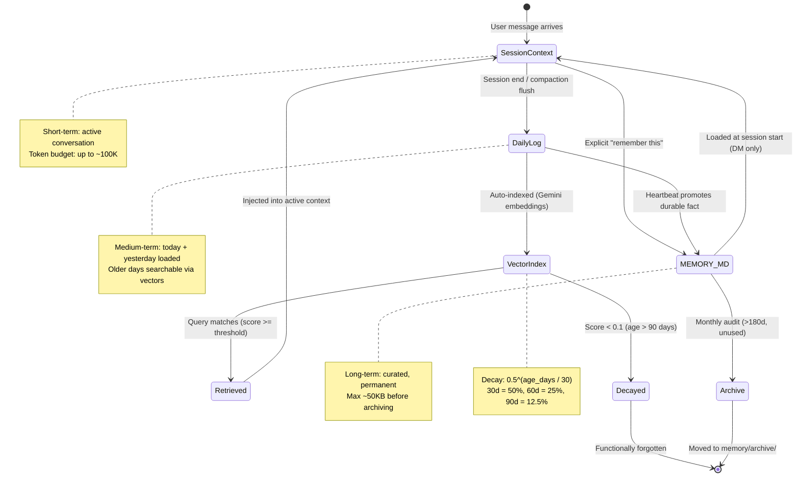
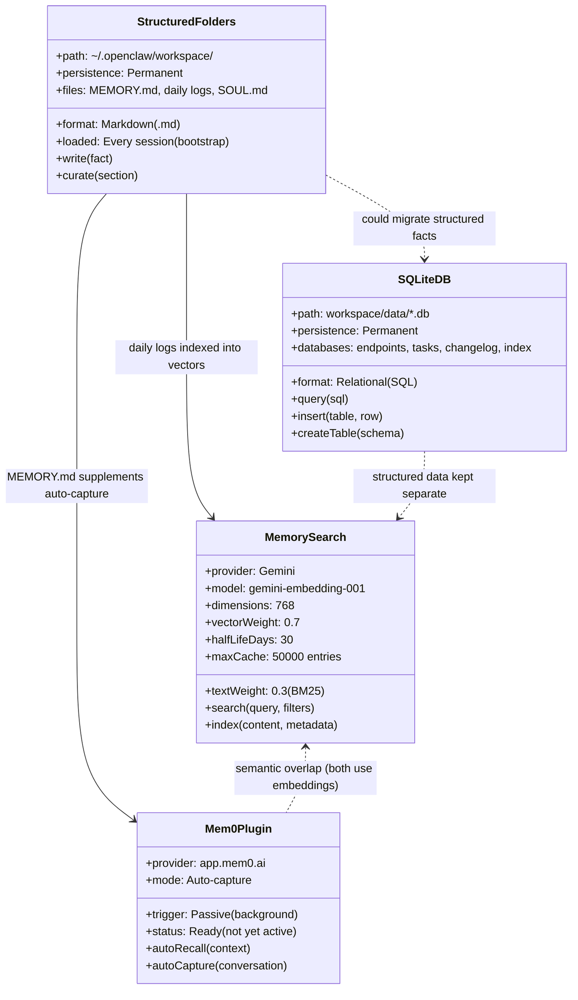
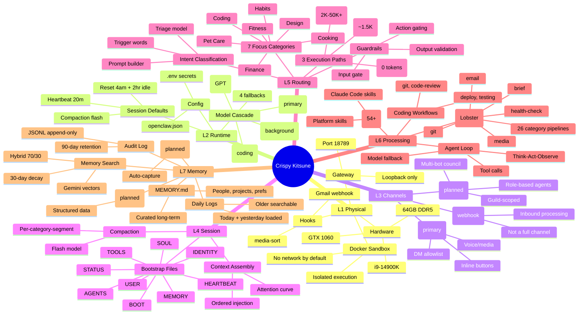
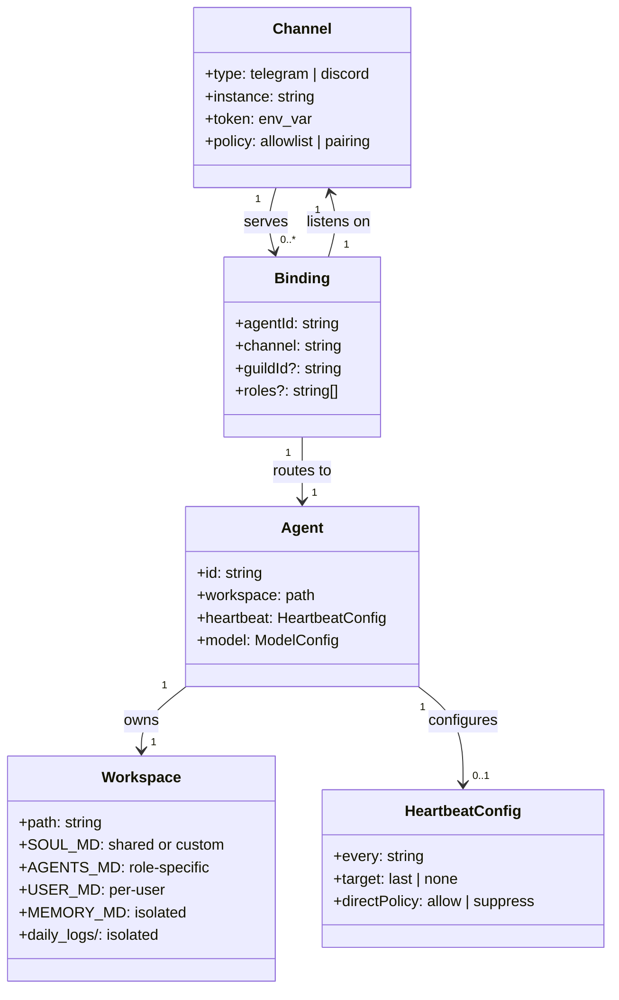

# Architecture Diagrams

> Visual diagrams covering memory lifecycle, background agents, system overview, and multi-bot architecture. Uses Mermaid diagram types beyond flowcharts: state, gantt, class, mindmap.

**Up →** [[stack/_overview]]

---

## Memory Lifecycle (State Diagram)

How a piece of information moves from initial capture through short-term to long-term storage. Compaction and heartbeat are the primary promotion triggers.



---

## Background Agent Schedule (Gantt)

What Crispy does when nobody is talking to it — and during active conversations. All background tasks use the flash model (cheapest inference).

```mermaid
gantt
    title Background Agent Schedule (24h)
    dateFormat HH:mm
    axisFormat %H:%M

    section Continuous
    Heartbeat check        :active, h1, 00:00, 24h
    Category classify      :active, c1, 00:00, 24h
    Compaction             :crit, co, 00:00, 24h

    section Scheduled
    Media catchup          :done, mc, 00:00, 24h
    Health check           :done, hc, 00:00, 24h
    Media cleanup          :milestone, m1, 02:00, 15min
    Daily brief            :milestone, b1, 08:00, 10min

    section Session
    Daily reset            :crit, r1, 04:00, 5min
    Idle timeout           :active, it, 00:00, 24h
```



### Schedule Summary

| Task | Schedule | Model | Cost | Purpose |
|------|----------|-------|------|---------|
| Heartbeat | Every 20 min (active session) | flash | ~100 tokens | Git dirty, disk, daily log size, pending reminders |
| Category classify | Per message (async) | flash | ~100 tokens | Tag messages with category:subcategory |
| Compaction | Context > ~120K tokens | flash | ~200 tokens/group | Per-category-segment summarization |
| Media catchup | */30 * * * * | — | 0 (pipeline) | Safety net for missed inbound processing |
| Health check | 0 * * * * | flash | ~100 tokens | Git, memory folder, disk, daily log checks |
| Media cleanup | 0 2 * * * | — | 0 (pipeline) | Archive 30d media, delete 90d archived |
| Daily brief | 0 8 * * * (PT) | flash | ~800 tokens | RSS, weather, git status, inbox summary |
| Daily reset | 4am PT | — | 0 | Clear context, save session JSONL |
| Idle timeout | After 2hr silence | — | 0 | Write checkpoint, close session |

---

## Four Memory Types (Class Diagram)

The 4 complementary storage methods. Each serves a different query pattern and persistence need.



### When to Use Each

| Method | Best For | Query Style | Example |
|--------|----------|-------------|---------|
| Folders (MEMORY.md) | Durable facts, preferences, people | Loaded automatically | "Marty prefers dark mode" |
| Memory Search | Past conversations, contextual recall | Semantic + keyword | "What chicken recipe did we discuss?" |
| Mem0 | Passive auto-capture, implicit memory | Automatic injection | System remembers without being told |
| SQLite | Structured data, exact lookups | SQL queries | "List all API endpoints with rate limits" |

---

## Full System Overview (Mindmap)

The complete Crispy Kitsune architecture at a glance — all 7 layers and their key subsystems.



---

## Multi-Bot Architecture (Class Diagram)

How multiple agents bind to multiple channel instances with isolated workspaces.



### Default Configuration (Starter)

```
Agents:
  crispy          → workspace/          → telegram    (Marty)
  crispy-wenting  → workspace-wenting/  → telegram1   (Wenting)
  crispy          → workspace/          → discord     (main guild)

Scaling to multi-bot Discord:
  discord-bot-1   → workspace-discord-1/ → discord1   (trading channel)
  discord-bot-2   → workspace-discord-2/ → discord2   (coding channel)
  discord-bot-3   → workspace-discord-3/ → discord3   (general channel)
```

---

## See Also

- [[stack/L7-memory/_overview]] — Memory layer detail (ER diagram, decay timeline)
- [[stack/L7-memory/memory-search]] — Search scoring pipeline
- [[stack/L6-processing/_overview]] — Processing layer (cron schedule)
- [[stack/L6-processing/agent-loop]] — Agent loop state machine
- [[stack/L5-routing/conversation-flows]] — Conversation lifecycle + progress bar
- [[stack/L5-routing/message-routing]] — Three routing paths
- [[stack/_overview]] — Config cascade diagram

---

**Up →** [[stack/_overview]]
